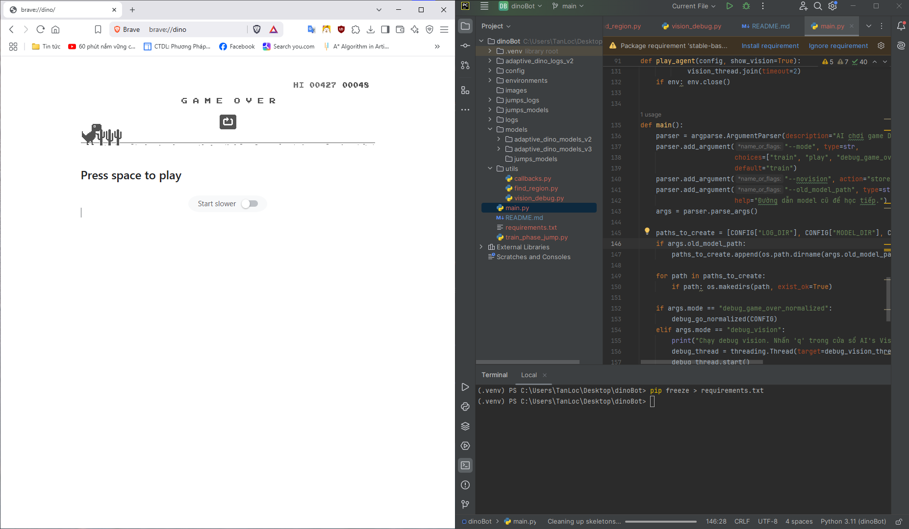
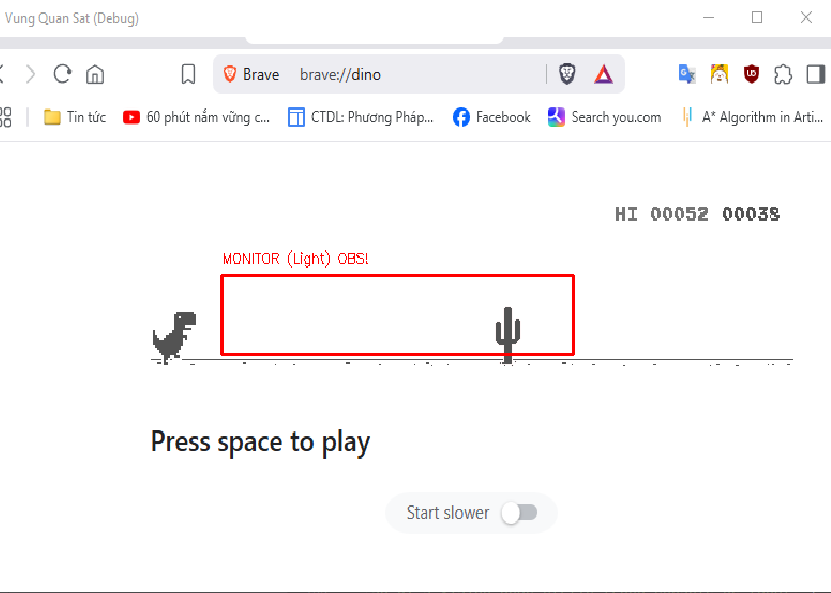

# Dino RL Agent - AI Tự Động Chơi Game Khủng Long


Dự án này triển khai một agent sử dụng Học Tăng Cường (Reinforcement Learning) để chơi game Khủng Long của Google Chrome. Điểm đặc biệt của agent này là khả năng **tự động thích ứng** (adaptive) với cả chế độ Sáng (Light Mode) và Tối (Dark Mode) của game mà không cần huấn luyện lại.

Agent được xây dựng bằng Python, sử dụng thư viện `stable-baselines3` cho thuật toán PPO và `pyautogui` để tương tác với game.

## Tính Năng Nổi Bật

-   **Thích ứng Chế độ:** Tự động phát hiện game đang ở chế độ Sáng hay Tối và chuẩn hóa hình ảnh đầu vào, giúp model hoạt động hiệu quả ở cả hai chế độ.
-   **Học Tăng Cường (Reinforcement Learning):** Sử dụng thuật toán **PPO (Proximal Policy Optimization)** từ `stable-baselines3` để huấn luyện agent.
-   **Học Tiếp Nối:** Dễ dàng huấn luyện tiếp từ một model đã có sẵn (`train_continue`) để cải thiện hiệu suất.
-   **Công Cụ Debug Trực Quan:** Cung cấp một cửa sổ "Vision Debug" để hiển thị vùng màn hình mà AI đang "nhìn", trạng thái phát hiện chướng ngại vật và chế độ game hiện tại.
-   **Cấu Hình Linh Hoạt:** Mọi thông số quan trọng (vùng màn hình, ngưỡng phát hiện, đường dẫn model) đều được tập trung trong file `config/game_config.py`.
-   **Kịch Bản Hỗ Trợ:** Bao gồm các script nhỏ để giúp người dùng dễ dàng xác định tọa độ vùng game và tinh chỉnh các ngưỡng phát hiện.

## Yêu Cầu

-   Python 3.11+
-   Trình duyệt Google Chrome (hoặc bất kỳ trình duyệt nào có game Dino, truy cập bằng cách gõ `chrome://dino` vào thanh địa chỉ).

## Cài Đặt & Cấu Hình

### 1. Clone Repository

```bash
git clone https://github.com/dtanlocc/RL-AI-PLAY-DINO.git
cd RL-AI-PLAY-DINO
```

### 2. Cài Đặt Các Thư Viện Cần Thiết

```bash
pip install -r requirements.txt
```

## Hướng Dẫn Sử Dụng

Sau khi đã cấu hình xong, bạn có thể bắt đầu sử dụng agent.

_**Quan trọng**: Trước khi chạy bất kỳ lệnh nào dưới đây, sử dụng screen splitting của windows, hãy mở cửa sổ game Dino và để nó ở vị trí sẵn sàng. Script sẽ đợi 5 giây để bạn chuyển sang cửa sổ game._


### 1. Huấn Luyện Model Mới
Lệnh này sẽ bắt đầu quá trình huấn luyện từ đầu.

```bash
python main.py --mode train --novision
```

### 2. Huấn Luyện Tiếp
Nếu bạn có một model đã được huấn luyện trước đó và muốn tiếp tục cải thiện nó:
```bash
python main.py --mode train_continue --old_model_path "duong/dan/toi/model_cu.zip" --novision

```

Nếu không cung cấp --old_model_path, script sẽ sử dụng đường dẫn mặc định trong game_config.py.

### 3. Cho AI Chơi
Sử dụng một model đã huấn luyện để chơi game. Hãy đảm bảo các đường dẫn MODEL_DIR_PLAY và MODEL_PLAY trong game_config.py là chính xác.

```bash
python main.py --mode play
```

### 4. Chạy Chế Độ Debug
Nếu bạn chỉ muốn xem các vùng phát hiện mà không cần huấn luyện hay chơi:



```bash
python main.py --mode debug_vision
```

Nhấn phím q trên cửa sổ "AI's Vision" hoặc Ctrl+C trong terminal để thoát.

## Tùy chọn 

### 1. Tinh chỉnh các REGION trong file game_config.py

Đầu tiên cần xác định REGION bằng lệnh

```bash
python utils/find_region.py
```

Sau đó coppy REGION đưa vào file game_config.py
```bash
/config/game_config.py

CONFIG = {
    # Dán giá trị bạn vừa tìm được vào đây
    "MONITOR_REGION": (231, 223, 328, 64), 
    
    # ... các cấu hình khác
}
```

### 2. Tinh chỉnh ngưỡng Game Over:
Bạn cũng nên tinh chỉnh vùng GAME_OVER_REGION. Chạy find_region.py một lần nữa để tìm tọa độ của chữ "GAME OVER". Sau đó, chạy script chẩn đoán để tìm ngưỡng pixel phù hợp:

```bash
python main.py --mode debug_game_over_normalized
```

## Link demo

https://youtu.be/UczeFyMiyiQ